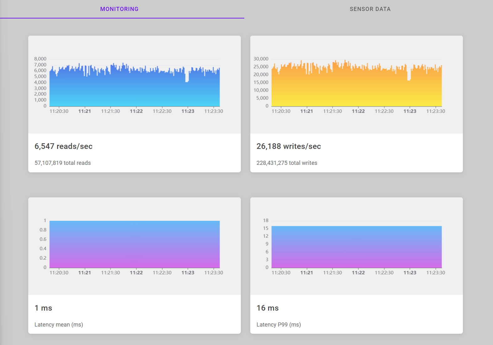

# ScyllaDB Quickstart Demo

This is a quick start demonstation of ScyllaDB with Docker.

To run the demo for yourself. First start a single node cluster with the following command:

    docker run -d --rm --name node1 scylladb/scylla

Next, run the demonstration application which will simulate artificial load from an internet of things app, 
measuring sensor data from millions of unique devices:

    docker run --rm --link node1:node1 --env DATABASE_URL=node1:9042 timkoopmans/scylladb-quickstart

